# Amazon_Vine_Analysis
Purpose: To determine if there is any bias toward favorable reviews from Vine members in a dataset.

## Overview of the analysis
The Amazon Vine program is a service that allows manufacturers and publishers to receive reviews for their products. A client SellBy about to release a large catalogue of products will be assisted in analyzing Amazon reviews written by members of the paid Amazon Vine program.  

The technical analysis deliverables required to complete the Amazon Vine analysis include:  

1. Perform ETL on Amazon Product Reviews.
2. Determine Bias of Vine Reviews.

## Resources
- Data Source: This analysis was performed using the  [Health_Personal_Care](https://s3.amazonaws.com/amazon-reviews-pds/tsv/amazon_reviews_us_Health_Personal_Care_v1_00.tsv.gz) dataset.
-  Codes: [Amazon Review ETL](https://github.com/aobasuyi/Amazon_Vine_Analysis/blob/main/Amazon_Reviews_ETL.ipynb) and [Vine Review Analysis](https://github.com/aobasuyi/Amazon_Vine_Analysis/blob/main/Vine_Review_Analysis.ipynb)
- Data Tools:  Google Colaboratory notebook
- Software: Apache Spark 3.0.3, Python 3.7, Visual Studio Code 1.50.0 

## Results: 
### Deliverable 1: Perform ETL on Amazon Product Reviews

- Using your knowledge of the cloud ETL process, create an AWS RDS database with tables in pgAdmin. Pick a dataset from the Amazon Review datasets and extract the dataset into a DataFrame. Transform the DataFrame into four separate DataFrames that match the table schema in pgAdmin. Then upload the transformed data into the appropriate tables and run queries in pgAdmin to confirm that the data has been uploaded.

#### The Health Personal Care extracted dataset is transformed into four DataFrames with the correct columns as shown:

- The customers DataFrame: 
  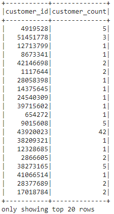  

- The products DataFrame: 
  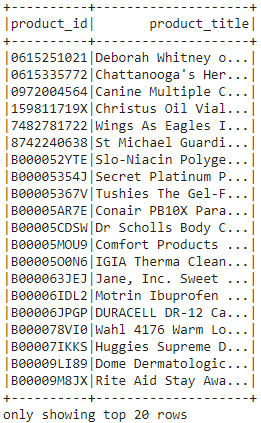  

- The review_id DataFrame: 
  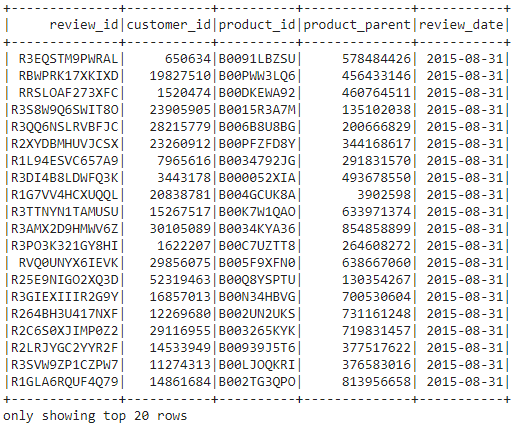  

- The vine DataFrame: 
  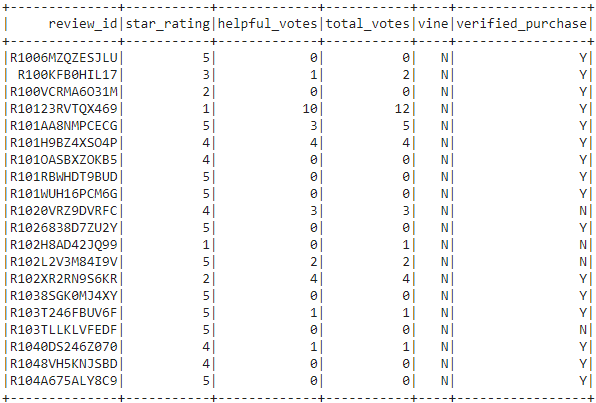  

#### All four DataFrames were loaded into their respective tables in pgAdmin. The query results to check that the tables have been populated are shown:

- The customers table (pgAdmin): 
  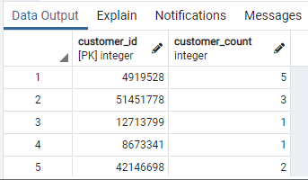  

| Customers table  | Query Result |
| ------------- | ------------- |
|   | 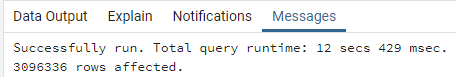 |

- The products_table (pgAdmin): 
    

| Customers table  | Query Result |
| ------------- | ------------- |
| 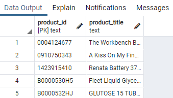  | 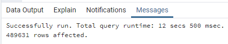 |

-  The review_id_table: 
  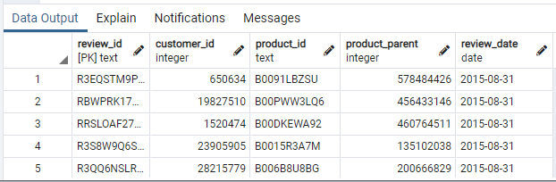  

| Customers table  | Query Result |
| ------------- | ------------- |
|   | 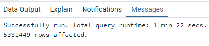 |

- The vine_table: 
  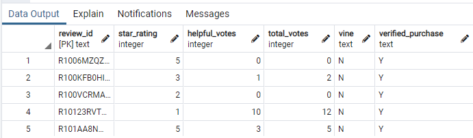  

| Customers table  | Query Result |
| ------------- | ------------- |
|   | 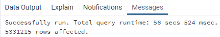 |

### Deliverable 2: Determine Bias of Vine Reviews

- Determine the total number of reviews.  
    - The total number of helpful reviews : **121360**

- How many Vine reviews and non-Vine reviews were there? 
- Determine the number of Vine reviews and non-Vine reviews.  
    - The number of helpful Vine reviews : **497**
    - The number of helpful non-Vine reviews : **120863**

- How many Vine reviews were 5 stars? How many non-Vine reviews were 5 stars?
- Determine how many Vine reviews and non-Vine reviews were 5 stars. 
    - The number of helpful 5-star Vine reviews : **220**
    - The number of helpful 5-star non-Vine reviews: **74470**

- What percentage of Vine reviews were 5 stars? What percentage of non-Vine reviews were 5 stars? 
Determine what percentage of Vine reviews and non-Vine reviews were 5 stars. 
    - The percentage of helpful Vine reviews that were 5 stars: 44.27%
    - The percentage of helpful non_Vine reviews that were 5 stars: 61.62%

## Summary: 
- In your summary, state if there is any positivity bias for reviews in the Vine program. Use the results of your analysis to support your statement. Then, provide one additional analysis that you could do with the dataset to support your statement.
- The results of the analysis show that Non-Amazon Vine members are more likely to give a Health Personal Care product a 5 star rating compared to an Amazon Vine member. Based on teh results of this dataset, there seems to be no positivity bias in the paid reviews compared to umpaid Vine reviews.

- An additional analysis carried out with the dataset (refer to the code here) to support this statement shows that.
    - The percentage of total Vine reviews for votes greater or equal to 20 that were 5 stars: **43.56%**
    - The percentage of total non_Vine reviews for votes greater or equal to 20 that were 5 stars: **57.24%**
